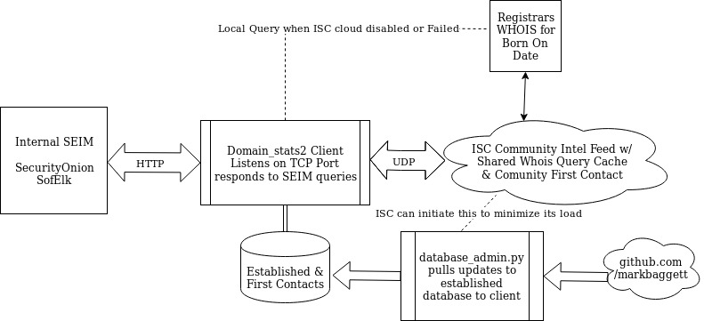

# domain_stats2

This is a complete rewrite and new approach to manaing baby domains in your organization.  Based on feedback from the community Domain_stats was really only used for baby domain information.  This new iteration focuses on that data and how to make it useful.  In this process it now tracks "FIRST CONTACT" so you know when your organization is has contacted a domain that you have not seen before.

The domain stats client is focused on quickly giving you 5 pieces of data for every domain name you ask it for.  That is when the domain was first seen by you, when it was first seen by the security community and when it was first seen by the web.

SEEN_BY_YOU - Values: FIRST-CONTACT or CreationDate

SEEN_BY_US  - Values: ESTABLISHED, FIRST-CONTACT, UNAVAILABLE or CreationDate

SEEN_BY_WEB - Values: ESTABLISHED, CreationDate

RANK        - Values: An approximation of the domains position in the Alexa top 1 million.  -1 if not in the top 1m

OTHER       - Values: Central server may provide additional data here such as warning for low freq scores, known malicious domains,e tc.


Here are some examples of how these are useful.
If your SIEM sees a request for google.com that is not a new domain and has been established for may years. Your response may look like this:

```
student@573:~/Documents/domain_stats2$ wget -q -O- http://127.0.0.1:8000/google.com
{"seen_by_web": "ESTABLISHED", "seen_by_us": "ESTABLISHED", "seen_by_you": "FIRST-CONTACT", "rank": 1, "other": "{}"}
```
When the domain has been around for more than two years domain stats responds and tells you that is an "ESTABLISHED" domain.  Notice that SEEN_BY_YOU is set to "FIRST-CONTACT". Since this is a brand new domain stats installation this is the first time my organization has ever queried google.  Every subsequent request will have the date and time when that wget query was run. You will only see "FIRST-CONTACT" once for each domain. Then it will be the date of that first contact. I also have some useful information like its "RANK" in the alexa top 1M. Website ranks change from time to time and this information is not the focus of this data.  It is just there to give you an idea of the popularity of the site.

Lets look at another domain.  Look at markbaggett.com.

```
student@573:~/Documents/domain_stats2$ wget -q -O- http://127.0.0.1:8000/markbaggett.com
{"seen_by_web": "2015-12-12 19:34:59", "seen_by_us": "2019-11-08 10:03:17.411863", "seen_by_you":"FIRST-CONTACT", "rank": -1, "other": "{}"}
```
The domain markbaggett.com wasn't in the local database on my server so it had to go off and ask the community server for that information. It got back a "seen_by_web" date of 12-12-2015.  This is the domains registration date.  It also has a date for "seen_by_us".  That is the first time ANYONE using domain_stats queried the central server for that domain.  If no one had ever asked about that domain this would have been "FIRST-CONTACT".   

A domain with a very recent "seen_by_web", "seen_by_us" and "seen_by_you" date should be investigated. The vast majority of domains have been around for a few years before they are stable and gain popularity.  Domains used by attackers are usually established shortly before they are used. 





You can check the efficiency of your domain_stats server cache with the following request.

$ wget -q -O- http://127.0.0.1:8000/stats
CacheInfo(hits=7, misses=559, maxsize=65536, currsize=365, cache_bytes=38464, app_kbytes=26132)
